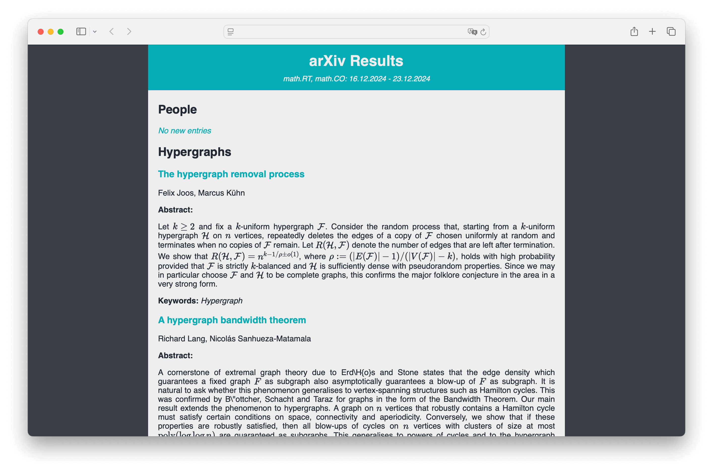

# Archive Trap

## Introduction

This repository contains an easy way to stay up to date on recent publications on [arXiv,org](https://arxiv.org)
by letting the user select a set of categories to search, e.g., *math.CO* and setting filters
which check a list of fields against a list of keywords, e.g., the *author* field against *Peter Scholze* and *June Huh*.

The entries which trigger one or more filters will get formatted as HTML and opened in the browser for easy viewing.

Intended audiences for this repository include:
- Casual / Hobbyist researchers who want to follow recent developments in their pet area or papers from specific researchers
- Researchers whose interests span a wide range of arXiv categories and who want to stay informed on various topics based on people or keywords




## Setup

To set up the repository, follow these steps:

1. Start by cloning it and installing the requirements
    ```bash
    git clone https://github.com/KainAber/arxiv-filter.git
    pip install -r requirements.txt
    ```
2. Optional: Update the `run config` value in `setup_config.yml` to the absolute path of the config file in which you want to specify the filters.
The default value points to `example/run_config.yml`
3. Customise the settings and filters in the run config (see [Run Config](##Run Config) for more info)
4. Run the code
   ```
   /path/to/python /path/to/repo/main.py
   ```

Since you can set up an alias in your shell for the execution of the script and also point the `setup_config.yml` to any place in the file system, the repository location can largely be ignored for day-to-day use.

## Run Config

This section steps through the parameters of the run config file using `example/run_config.yml` as an example.

The config file consists of sections for `run settings`, `data`, and `filters`.

### Run Settings

**Example:**
```YAML
run settings:
  output folder: example/output
  display by: filters
```
The `output folder` argument specifies the path to the folder where the HTML files are stored and from which they are opened (using `subprocess.run`). <br>
**Note:** The example uses a relative path, but it is recommended that if changed, an absolute path to the output folder is specified.

The `display by` argument can be set to `filters` or `entries` where the former displays results grouped by filters
(entries may appear multiple times) and the latter displays each entry exactly once and summarises the relevant filters.

### Data

**Example:**
```YAML
data:
  categories:
    - math.RT
    - math.CO
  days to fetch: 7
```

Since the code performs one big search for all filters, the `categories` to search need to be specified beforehand.
For more information on arXiv categories, visit [arXiv Category Taxonomy](https://arxiv.org/category_taxonomy).

The last thing that needs to be specified is the timeframe to fetch.
Timeframes always end in the current day and can be specified via the `days to fetch` argument, or alternatively via
by adding `only new days: True` to the `data` section.<br>
When this argument is specified and set to `True`, the code checks the `output folder` for HTML files of previous runs
and sets the start date of the timeframe to the latest fetched day.

**Example:**
```YAML
data:
  categories:
    - math.RT
    - math.CO
  only new days: True
```

### Filters

**Example:**
```YAML
filters:
  - name: People
    fields:
      - author
    keywords:
      - Peter Scholze
      - June Huh
  - name: Hypergraphs
    fields:
      - title
      - summary
    keywords:
      - Hypergraph
```

The filters are specified in a list of dictionaries.

Each filter contains a `name` argument, a list of `fields` to search,
and a list of `keywords` for which to search.

For an entry to appear in the final results, any filter needs to be triggered for any of the keywords.
This means that the above example filters searches for arXiv entries whose author names include *Peter Scholze* or *June Huh*,
or whose title or summary (abstract) include *Hypergraph* (ignoring capitalisation).

## Acknowledgements

* Thank you to arXiv for use of its open access interoperability
* The color scheme used is from [colorhunt.co](https://colorhunt.co/palette/222831393e4600adb5eeeeee)
